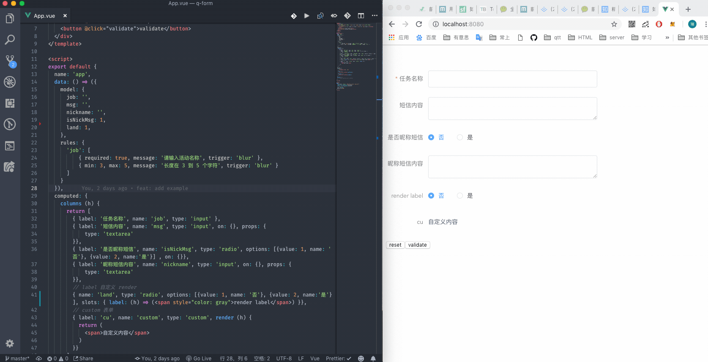

<p align="center" style="text-align: center;"></p>
<h2 style="text-align: center;" align="center">so-form 📰</h2>
<p align="center" style="text-align: center;">渐进式通用vue表单</p>

## Introduction

- so-form 是一个自动双向数据绑定，可拓展，提供 `json-schema` 自动渲染出对应表单组件`vue`插件
- so-form 对第三方组件库无侵入，提供了高度抽象能力解决繁琐的表单配置插件

## feature

- json-schema 2 form
- 自动双向数据绑定
- 表单支持自定义 render（[jsx 写法](https://cn.vuejs.org/v2/guide/render-function.html#JSX)）
- 支持拓展 components
- 各种方便插槽
- 全局切换`edit`/`preview`状态
- 目前支持`element-ui`跟`iview` ui框架

## install

```shell
  # vue支持 jsx写法
  npm i babel-plugin-syntax-jsx babel-plugin-transform-vue-jsx --save-dev

  # 在.babelrc文件中加入
  "plugins": ["transform-vue-jsx"]

  # 引入
  npm i so-form --save

```

## usage
- 📘 [中文文档](https://ws456999.github.io/so-form/)


## example gif

例如下图，通过左边的简单配置，就可以生成右边表单。



## 组件

- custom(自己写 render)
- input
- textarea
- select
- checkbox
- radio
- switch
- slider
- datepicker
- timeselect
- timepicker
- inputnumber
- rate
- cascader
- tree
- upload

## todo

- [x] 支持 iview
- [ ] babel插件，按需加载
- [ ] 插槽要适当gap
- [ ] global components 的重写名字

## changelog

_2018-11-12_

- 提供文档

_2018-11-07_

- 支持注册自定义 form 组件
- add when props

_2018-11-05_

- 添加全局切换`edit`/`preview`状态功能
