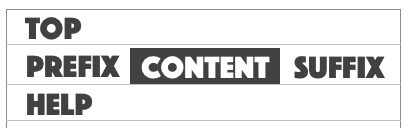

## 常用demo

### 条件渲染

通过`when`参数来控制（类型`boolean` or `function`）

<box>
  <vuecode md>
    <div slot="demo">
      <demos-when></demos-when>
    </div>
    <div slot="code">

```html
<template>
<div>
  <iForm label-width="100px" :model="model">
    <iFormRows :rows="rows"></iFormRows>
  </iForm>
  <el-button @click="whenJob=!whenJob">toggle显示任务名称</el-button>
  <el-button @click="whenMsg=!whenMsg">toggle显示是否短信</el-button>
</div>
</template>

<script>
export default {
  name: 'app',
  data: () => ({
    model: {
      job: '',
      isNickMsg: 1
    },
    whenJob: true,
    whenMsg: true
  }),
  computed: {
    rows (h) {
      return [
        { label: '任务名称', name: 'job', type: 'input', when: this.whenJob },
        { label: '是否短信', name: 'isNickMsg', type: 'radio', options: [{value: 1, name: '否'}, {value: 2, name:'是'}], when: () => this.whenMsg },
      ]
    }
  }
}
</script>
```

  </div>
  </vuecode>
</box>

---

### 好用的插槽

通过`prefix`, `suffix`, `top`, `bottom`, 参数来控制（类型`boolean` or `function`）



<box>
  <vuecode md>
    <div slot="demo">
      <demos-slot></demos-slot>
    </div>
    <div slot="code">

```html
<template>
<div>
  <iForm label-width="100px" :model="model">
    <iFormRows :rows="rows"></iFormRows>
  </iForm>
  <el-button @click="prefix='prefix'">prefix</el-button>
  <el-button @click="suffix = 'suffix'">suffix</el-button>
  <el-button @click="top='top'">top</el-button>
  <el-button @click="bottom='bottom'">bottom</el-button>
</div>
</template>

<script>
export default {
  name: 'app',
  data: () => ({
    model: {
      job: '',
      job2: ''
    },
    prefix: '',
    suffix: '',
    bottom: '',
    top: ''
  }),
  computed: {
    rows (h) {
      return [
        { label: '任务名称', name: 'job', type: 'input', prefix: this.prefix, suffix: this.suffix, bottom: this.bottom, top: this.top },
        { label: 'slot render', name: 'job2', type: 'input', bottom: (h) => {
            return <div style="color: blue;">bottom by render</div>
          }
        },
      ]
    }
  }
}
</script>
```

  </div>
  </vuecode>
</box>

---

### 自定义渲染

若 `type = 'custom'`, 表单的内容通过`render`参数输出

<box>
  <vuecode md>
    <div slot="demo">
      <demos-custom-render />
    </div>
    <div slot="code">

```html
<template>
<div>
  <iForm label-width="150px" :model="model">
    <iFormRows :rows="rows"></iFormRows>
  </iForm>
</div>
</template>

<script>
export default {
  data: () => ({
    model: {}
  }),
  computed: {
    rows (h) {
      return [
        { label: 'custom render', name: 'custom', type: 'custom', render: (h) => {
            return (
              <div>
                <p>content by custom render </p>
                <button tpye="button">custom button</button>
              </div>
            )
          }
        },
      ]
    }
  }
}
</script>

```

  </div>
  </vuecode>
</box>
